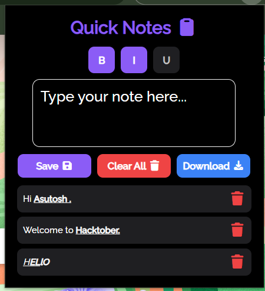

# Quick Notes Extension

A modern, dark-themed, distraction-free note-taking Chrome extension that lets you quickly jot down thoughts, apply text formatting, and save or download your notes instantly. Built for productivity and simplicity.

---

## Features

- Instant Note-Taking: Type and save notes with a single click or by pressing Enter.  
- Auto-Save: Drafts are automatically saved while typing — never lose your ideas.  
- Rich Text Formatting: Apply Bold, Italic, or Underline styles to your notes. Multiple styles can be combined seamlessly.  
- Delete Individual Notes: Remove any note with one click.  
- Clear All Notes: Delete all saved notes at once.  
- Download Notes: Export all notes as a `.txt` file for offline use.  
- Dark & Sleek Interface: Minimal, modern, and easy on the eyes.  
- Custom Font Support: Uses your chosen font for a polished look.

---

## Screenshots

  

---

## Installation

1. Clone or download this repository.  
2. Open Chrome and navigate to `chrome://extensions/`.  
3. Enable **Developer Mode** in the top-right corner.  
4. Click **Load unpacked** and select the folder containing this extension.  
5. The extension icon will appear in your toolbar — click it to start taking notes.

---

## Usage

1. Click the **Quick Notes** icon in the browser toolbar.  
2. Type your note in the input area.  
3. Use the toolbar buttons to apply Bold, Italic, or Underline styles.  
4. Press **Enter** (without Shift) or click **Save** to store the note.  
5. To delete a note, click the trash icon next to it.  
6. To remove all notes, click **Clear All**.  
7. To export your notes, click **Download** to get a `.txt` file.

---

## Folder Structure
```md
QuickNotes_DearAsutosh/
    ├── fonts/
    │   └── RalewayFont.ttf
    ├── icon.png
    ├── popup.html
    ├── popup.js
    ├── style.css
    ├── manifest.json
    ├── readme.md
    └── screenshot.png
```
---
## Manifest

```json
{
  "manifest_version": 3,
  "name": "Quick Notes",
  "version": "1.0",
  "description": "A simple browser extension for taking quick notes with auto-save and clear options.",
  "action": {
    "default_popup": "popup.html",
    "default_icon": "icon.png"
  },
  "permissions": ["storage", "activeTab","downloads"]
}
```
---
## Technologies Used

- HTML5, CSS3, JS for extension logic and UI
- ContentEditable div for rich-text editing
- LocalStorage API for persistent storage
- Blob API for downloading notes
- Font Awesome for icons
- Custom Fonts for sleek typography
