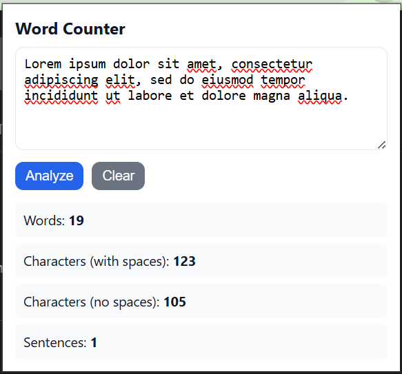

# Word Counter Extension

A lightweight, minimal Chrome extension that counts **words**, **characters**, and **sentences** in any selected text. Perfect for writers, students, and anyone who needs quick text statistics without leaving the browser.

---

## ✨ Features

- **Right-Click Word Count:** Instantly analyze any selected text via the context menu.  
- **Detailed Stats:** View word count, total characters (with & without spaces), and sentence count.  
- **Smart Text Detection:** Automatically fetches selected text when the popup opens.  
- **Manual Input Option:** Paste or type text directly in the popup to analyze manually.  
- **Minimal Interface:** Clean and distraction-free UI focused on readability.  
- **Auto Popup Launch:** Opens automatically after you right-click and analyze a selection.  

---

## 🧠 How It Works

1. Highlight any text on a webpage.  
2. Right-click and select **“Analyze selection — Word Counter.”**  
3. The popup will appear showing:
   - Word count  
   - Character count (with & without spaces)  
   - Sentence count  

You can also click the extension icon manually and paste your own text into the popup for analysis.

---

## 🖼️ Screenshot

Here’s how the extension popup looks:



---

## 🧩 Installation

1. **Clone or Download** this repository.  
2. Open Chrome and go to `chrome://extensions/`.  
3. Enable **Developer Mode** (top-right corner).  
4. Click **Load unpacked** and select the folder containing this extension.  
5. The extension icon will appear in your toolbar — click it to start analyzing text.

---

## 🚀 Usage

- **Right-Click Analysis:**  
  Select text → Right-click → Choose **Analyze selection — Word Counter**.

- **Manual Analysis:**  
  Click the extension icon → Paste or type text → Click **Analyze**.

- **Clear Input:**  
  Use the **Clear** button to reset the text area.

---

## 📂 Folder Structure

    
    WordCounter_Tamjid17/
    ├── icon.png
    ├── background.js
    ├── popup.html
    ├── popup.js
    ├── styles.css
    ├── manifest.json
    ├── readme.md
    └── extension-screenshot.png

---

## 🧾 manifest.json

```json
{
  "manifest_version": 3,
  "name": "Word Counter",
  "version": "1.0",
  "description": "Counts words, characters, and sentences for selected text.",
  "action": {
    "default_popup": "popup.html",
    "default_icon": "icon.png"
  },
  "permissions": ["storage", "activeTab", "contextMenus"],
  "background": {
    "service_worker": "background.js"
  }
}
```

---

## 🛠️ Technologies Used
1. **HTML5, CSS3, JavaScript**: Core UI and Logic.  
2. **Chrome Context Menu API**: For right-click selection analysis.  
3. **Chrome Storage API**: To store and retrieve selected text.  
4. **Manifest V3**: Latest Chrome extension architecture.  
5. **Regex-based Parsing**: For accurate word and sentence counting.

---

## 💡 Notes

- Sentence counting uses a simple punctuation-based heuristic (e.g., ., ?, !), which may vary slightly for complex text.
- Works on most webpages that allow text selection.
- All processing is done locally — no data is sent anywhere.
---
#### Built with ❤️ by [Tamjid](https://github.com/tamjid17)