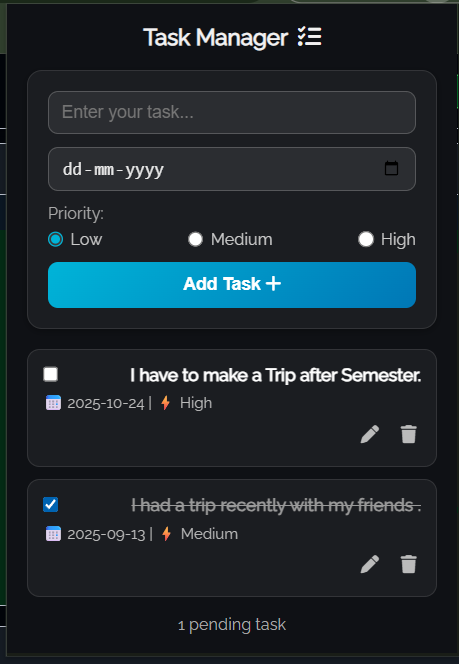

# Task Manager Extension

A lightweight, modern, and productive Chrome extension that helps you manage your daily tasks with priorities, due dates, and progress tracking — all right from your browser toolbar. Built for focus, simplicity, and persistence.

---

## Features

- **Add Tasks**: Create new tasks instantly with title, due date, and priority.

- **Mark Complete**: Toggle tasks as done or pending with a single click.

- **Edit & Delete**: Update task details or remove them anytime.

- **Priority Levels**: Choose between Low, Medium, or High priorities to stay organized.

- **Due Date Tracking**: Never miss important deadlines again.

- **Persistent Storage**: All tasks are saved automatically using Chrome Storage API.

- **Auto Sync**: Access your task list across multiple Chrome sessions.

- **Smart Sorting**: Tasks are automatically ordered by priority (High → Low).

- **Clean Interface**: Minimal, distraction-free layout designed for productivity.
---

## Screenshots

  

---

## Installation

1. Clone or download this repository.  
2. Open Chrome and navigate to `chrome://extensions/`.  
3. Enable **Developer Mode** in the top-right corner.  
4. Click **Load unpacked** and select the folder containing this extension.  
5. Once loaded, you’ll see the `Task Manager` icon in your toolbar — click it to start managing your tasks.

---

## Usage

1. Click the `Task Manager` icon in your browser toolbar.
2. Type your task title and select a due date.
3. Choose your priority level (Low / Medium / High).
4. Click Add Task to save it instantly.
5. Mark a task complete using the checkbox beside it.
6. Edit or delete tasks using the ✏️ or 🗑️ buttons.
7. Your tasks are automatically saved — ***even after closing the browser***.

---

## Folder Structure
```md
TaskManager_DearAsutosh/
    ├── fonts/
    │   └── RalewayFont.ttf
    ├── icon.png
    ├── popup.html
    ├── popup.js
    ├── style.css
    ├── manifest.json
    ├── readme.md
    └── screenshot.png
```
---
## Manifest

```json

{
  "manifest_version": 3,
  "name": "Task Manager",
  "version": "1.0",
  "description": "A lightweight task manager with due dates, priority tracking, and persistent storage using Chrome Storage API.",
  "permissions": ["storage"],
  "action": {
    "default_popup": "popup.html",
    "default_icon": "icon.png"
  },
  "icons": {
    "128": "icon.png"
  },
  "author": "DearAsutosh"
}

```
---
## Technologies Used

- HTML5, CSS3, JavaScript for interface and logic
- Chrome Storage API for data persistence
- Radio Buttons for exclusive priority selection
- Dynamic DOM Rendering for real-time task updates
- Tab & ActiveTab Permissions for potential future features
- Raleway Font for clean, modern typography
