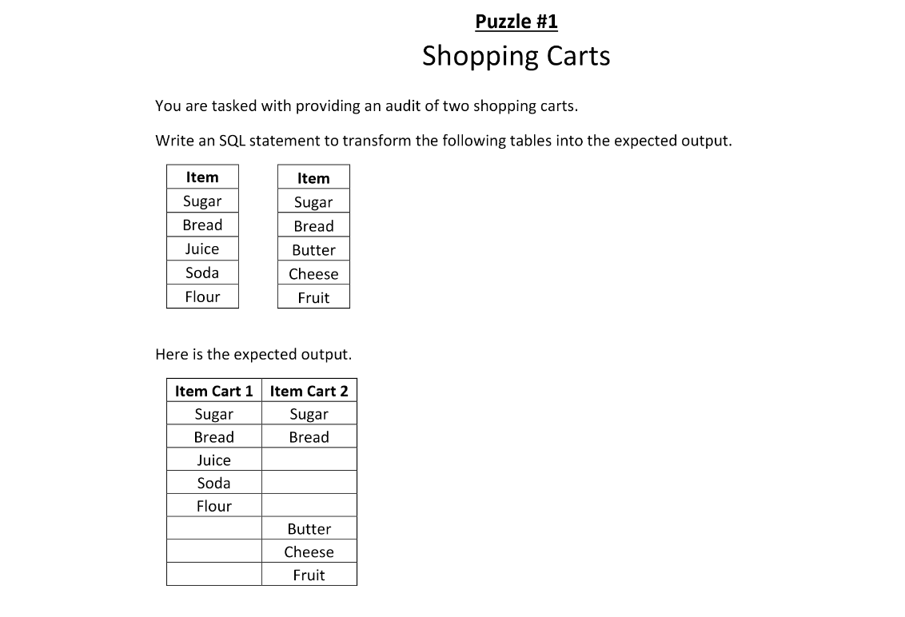

        

## STARTER CODE
microsoft sql server T-SQL
```
DROP TABLE IF EXISTS #Cart1;
DROP TABLE IF EXISTS #Cart2;

CREATE TABLE #Cart1
(
Item  VARCHAR(100) PRIMARY KEY
);

CREATE TABLE #Cart2
(
Item  VARCHAR(100) PRIMARY KEY
);

INSERT INTO #Cart1 (Item) VALUES
('Sugar'),('Bread'),('Juice'),('Soda'),('Flour');

INSERT INTO #Cart2 (Item) VALUES
('Sugar'),('Bread'),('Butter'),('Cheese'),('Fruit');

```