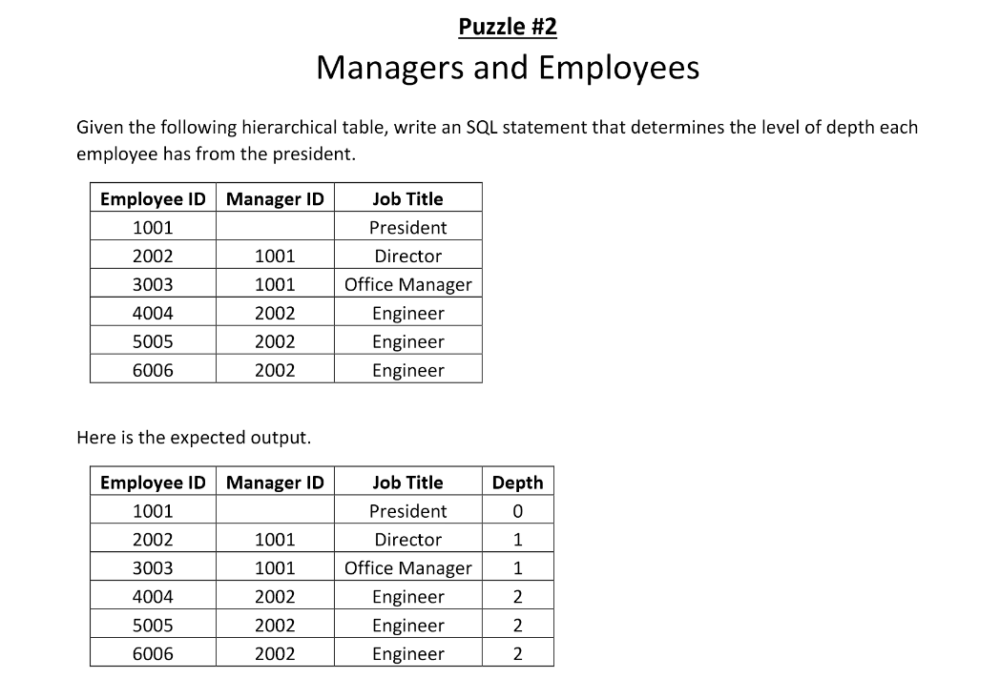

        

## STARTER CODE
microsoft sql server T-SQL
```
DROP TABLE IF EXISTS #Employees;

CREATE TABLE #Employees
(
EmployeeID  INTEGER PRIMARY KEY,
ManagerID   INTEGER NULL,
JobTitle    VARCHAR(100) NOT NULL
);

INSERT INTO #Employees (EmployeeID, ManagerID, JobTitle) VALUES
(1001,NULL,'President'),(2002,1001,'Director'),
(3003,1001,'Office Manager'),(4004,2002,'Engineer'),
(5005,2002,'Engineer'),(6006,2002,'Engineer');
```