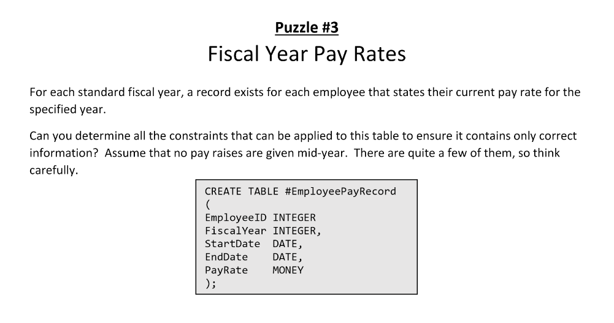

       
## STARTER CODE
microsoft sql server T-SQL
```
DROP TABLE IF EXISTS #EmployeePayRecords;

CREATE TABLE #EmployeePayRecords
(
EmployeeID  INTEGER,
FiscalYear  INTEGER,
StartDate   DATE,
EndDate     DATE,
PayRate     MONEY
);
```