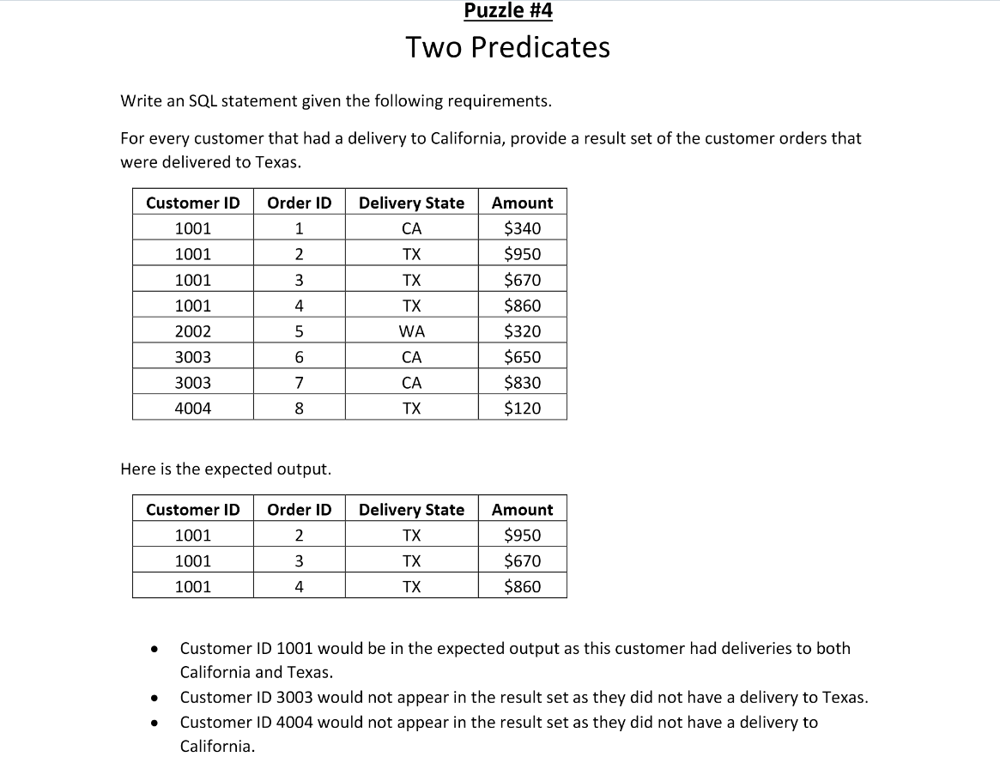

       

## STARTER CODE
microsoft sql server T-SQL
```
DROP TABLE IF EXISTS #Orders;
GO

CREATE TABLE #Orders
(
CustomerID     INTEGER,
OrderID        INTEGER,
DeliveryState  VARCHAR(100) NOT NULL,
Amount         MONEY NOT NULL,
PRIMARY KEY (CustomerID, OrderID)
);
GO

INSERT INTO #Orders (CustomerID, OrderID, DeliveryState, Amount) VALUES
(1001,1,'CA',340),(1001,2,'TX',950),(1001,3,'TX',670),
(1001,4,'TX',860),(2002,5,'WA',320),(3003,6,'CA',650),
(3003,7,'CA',830),(4004,8,'TX',120);
GO
```