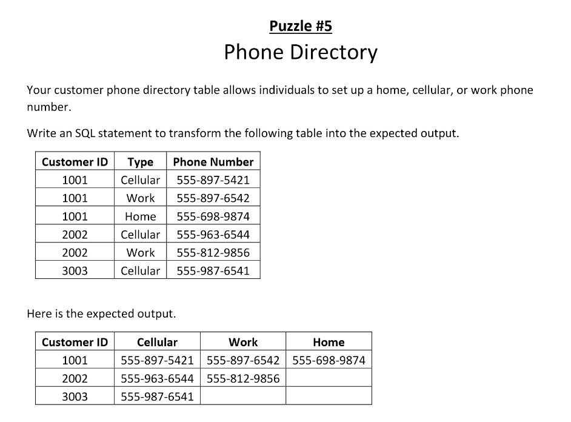

## STARTER CODE
microsoft sql server T-SQL
```
DROP TABLE IF EXISTS #PhoneDirectory;
GO

CREATE TABLE #PhoneDirectory
(
CustomerID   INTEGER,
[Type]       VARCHAR(100),
PhoneNumber  VARCHAR(12) NOT NULL,
PRIMARY KEY (CustomerID, [Type])
);
GO

INSERT INTO #PhoneDirectory (CustomerID, [Type], PhoneNumber) VALUES
(1001,'Cellular','555-897-5421'),
(1001,'Work','555-897-6542'),
(1001,'Home','555-698-9874'),
(2002,'Cellular','555-963-6544'),
(2002,'Work','555-812-9856'),
(3003,'Cellular','555-987-6541');
GO
```