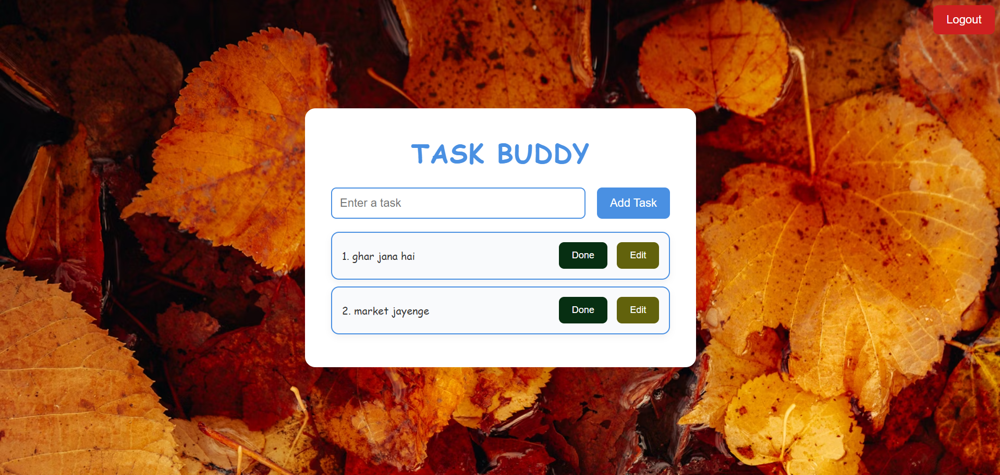

# Task Buddy

This project is a **Task Management Web Application** that allows users to sign up, log in, and manage their tasks. It includes a client-side interface for users and a server-side application for handling authentication and task management.

## Project Structure

### Client-Side (Frontend)

client/
├── Login/ # Login page components
│ ├── index.html # Login page markup
│ ├── script.js # Login page scripts
│ └── style.css # Login page specific styles
├── Signup/ # Signup page components
│ ├── index.html # Signup page markup
│ ├── script.js # Signup page scripts
│ └── style.css # Signup page specific styles
└── Todo/ # Task (Todo) management page
└── index.html # Todo page markup and logic

### Server-Side (Backend)

server/
├── .env # Environment variables (e.g., database credentials, JWT secrets)
├── .gitignore # Git ignore file (to exclude node_modules, .env, etc.)
├── index.js # Entry point for the server, sets up the app and routes
├── package.json # Lists project dependencies and scripts
├── controllers/ # Controllers for handling request logic
│ └── user.controllers.js # Controller for user-related actions (signup, login, etc.)
└── middlewares/ # Middleware functions
└── jwt.js # JWT authentication middleware to protect routes

## Project Setup

### Prerequisites

- Node.js installed on your machine.
- Environment variables set in `.env` file for database connection and JWT configuration.

### Installation

1. **Clone the repository and than**:

   ```bash
   cd task-buddy
   ```

2. **Install server dependencies**:

   ```bash
   cd server
   npm install
   ```

3. **Set up environment variables** in the `server/.env` file:

   ```
   PORT=<your_port></your_port>
   JWT_SECRET=<your-jwt-secret>
   ```

4. **Run the server**:
   ```bash
   npx nodemon
   ```

### Frontend Setup

1. Open the `client/index.html` in your browser to access the landing page of the app.
2. Navigate to `/Login/index.html` for the login page and `/Signup/index.html` for the sign-up page.
3. After logging in, the user will be redirected to `/Todo/index.html` to manage tasks.

## Features

- **User Authentication**:
  - Sign up and log in securely using JWT (JSON Web Token).
- **Task Management**:

  - Add, edit, and delete tasks.
  - User tasks are saved and displayed dynamically.

- **Secure Routes**:
  - Protected routes using JWT middleware to ensure only authenticated users can access their tasks.

## Overview


